# Two Level Branch Predictor Simulator  
EE382N Superscalar Microprocessor Architecture, Spring 2019, Assignment 4  
(C) 2019 Bagus Hanindhito (hanindhito[at]bagus[dot]my[dot]id)  

[](https://zenodo.org/badge/latestdoi/181817027)

## Introduction
This is the implementation of two-level branch predictor with branch history shift register table and pattern history table based on the papers below.  
[1] T. Yeh, Y. Patt, "A comparison of dynamic branch predictors that use two levels of branch history", Proceedings of the 20th Annual International Symposium on Computer Architecture, pp. 257-266, 1993.  
[2] T-Y Yeh, Y.N. Patt, "Two-Level Adaptive Branch Prediction", Proceedings of the 24th Annual ACM/IEEE International Symposium and Workshop on Microarchitecture, pp. 51-61, 1991-Nov.  
[3] T-Y Yeh, Y.N. Patt, "Alternative Implementations of Two-Level Adaptive Branch Prediction", Proceedings of the 19th International Symposium on Computer Architecture, pp. 124-134, 1992-May.  

As an addition, this code can also simulate one-level branch predictor using the branch history table as a comparison to the two-level one. All of the code are implemented in C++11 and are written on Ubuntu on Windows Subsystem Linux with GCC 5.4.0.

## Getting Started
You can get the code, compile them, and run them very easily by following these steps.

### Clone and Compile
You can follow these commands to clone and compile the code on your local machine.
```bash
git clone https://github.com/hibagus/TwoLevelBPSimulator.git
cd TwoLevelBPSimulator
make
```

### Running the Simulator
If the compilation goes well, you can run the simulator by giving appropriate arguments to the program as follows.
```bash
./sim [tracefile] [r]              One-Level Branch Predictor with configurable number of BHT entrie(s).
./sim [tracefile] [i] [j] [k] [s]  Two-Level Branch Predictor with custom BHSR size and PHT size.
```

The arguments that the simulator needs are explained below.  
```
tracefile = a compatible plain text tracefile for simulation input.  
r         = log2(number of BHT entry)  
i         = log2(number of BHSR entry)  
j         = log2(number of PHT table)  
k         = BHSR Length  
s         = log2(number of Set)  
```
For one-level predictor, the r must not be a negative number.  
For two-level predictor, the i, j, k, and s must satisfy the following requirements.  
```
  XAx  | [log2(# BHSR)] | [log2(# PHT)] | [BHSR Length] | [log2(# Set)]  
  XAx  |        i       |       j       |     k         |      s         
  -----|----------------|---------------|---------------|--------------  
  GAg  |       i=0      |      j=0      |    k>=0       |     s=0        
  GAs  |       i=0      |      j>i      |    k>=0       |    0<s<j       
  GAp  |       i=0      |      j>i      |    k>=0       |     s=0        
  SAg  |       i>0      |      j=0      |    k>=0       |    0<s<i       
  SAs  |       i>0      |     0<j<i     |    k>=0       |    0<s<i       
  SAp  |       i>0      |      j>=i     |    k>=0       |    0<s<i       
  PAg  |       i>0      |      j=0      |    k>=0       |     s=0        
  PAs  |       i>0      |     0<j<i     |    k>=0       |     s=0        
  PAp  |       i>0      |      j>=i     |    k>=0       |     s=0        
```
  
### Tracefile format
This simulator requires simple tracefile in plain text format for simulation. Each line of the plain text should hold one entry of the trace. Each entry of the tracefile consists of address of branch instruction which is in the format of decimal and the actual outcome of this branch where 0 denotes the branch is not actually taken and 1 denotes the branch is actually taken. Here is the sample of the tracefile contents.
```
3253361352  1
3253361380  1
3253361375  0
3253361380  1
3253361375  0
```
### Test File
A simple test program to test the functionality of each module of the simulator is given on the test/test.cpp file.

## Basic Modules
The simulator has two basic modules as a building block of the branch predictor. 

### Branch History Shift Register
  
The BHSR is basically an k-bit shift register that stores the history of the outcome from the last k branches. If a new branch is encountered and the outcome is “taken”, then BHSR is shifted to the left and bit “1” is inserted as the new LSB. Likewise, if the new branch’s outcome is “not taken”, the BHSR is shifted to the left and bit “0” is inserted as the new LSB. The excess MSB is automatically truncated, keeping the length of BHSR constant.

### Two-Bit Saturating Counter
  
The Two-Bit Saturating Counter is a two-bit finite state machine that indicates the outcome pattern of the branches. There are four states indexed using two-bit: strong taken (T), weak taken (t), weak not taken (n), and strong not taken (N). By default in this simulator, the counter is initialized in weak not taken  (n) state.

## One-Level Branch Predictor
  
This predictor consists of a branch history table indexed using the program counter address. The number of entries inside the branch history is configurable. Each entry has a tag field that stores the address of branch instruction and a 2-bit saturating counter initialized as weakly not taken. If there is an aliasing (i.e., different address pointing to the same entry), the old entry will be replaced by the new one and the counter is initialized as weakly not taken. You can run the simulation using this one-level branch predictor by specifying the number of entries inside the BHT as an argument to the simulator.

## Two-Level Branch Predictor
Then, here we go with two-level branch predictor. It uses branch history shift register table as its first level of branch predictor and pattern history tables as its second level of branch predictor. As the paper suggests, there are nine possible configurations for this type of branch predictor. The assignment only gives me four variable (as arguments for simulator) to tell the simulator which branch predictor configuration should it make. Therefore, by specifying those four arguments, the simulator will try to infer the configuration of the two-level branch predictor we want to simulate. The process of infering configuration of the branch predictor may be different if we use five arguments instead of only four. 

### Possible Configurations
There are nine possible configurations for the two-level branch predictor as follows.  

| First Level (Branch History)	| Second Level (Pattern History) |	Configuration Name
| ----------------------------- | ------------------------------ | ------
| Kept Globally	                | Kept Globally	                 |  GAg
| Kept Globally	                | Kept per Set	                 |  GAs
| Kept Globally	                | Kept per Address	             |  GAp
| Kept per Set	                | Kept Globally	                 |  SAg
| Kept per Set	                | Kept per Set	                 |  SAs
| Kept per Set	                | Kept per Address	             |  SAp
| Kept per Address	            | Kept Globally	                 |  PAg
| Kept per Address	            | Kept per Set	                 |  PAs
| Kept per Address	            | Kept per Address	             |  PAp

### Infering Configuration from Arguments
There are only four parameters that the simulator accepts to infer the configuration of the two-level branch predictor (i.e., it is required in assignment). Therefore, I derived the requirements of the combination of the arguments to configure the branch predictor as follows. Note that this requirements may change if you add more arguments to determine the configurations into the simulator.

| Configuration Name	|  i  |  j   | k    | s
| ----------------------| --- | ---  | ---  | --- 
| GAg                   | i=0 |  j=0 | k>=0 |  s=0 
| GAs                   | i=0 |  j>i | k>=0 | 0<s<j
| GAp                   | i=0 |  j>i | k>=0 |  s=0 
| SAg                   | i>0 |  j=0 | k>=0 | 0<s<i
| SAs                   | i>0 | 0<j<i| k>=0 | 0<s<i
| SAp                   | i>0 |  j>=i| k>=0 | 0<s<i
| PAg     	            | i>0 |  j=0 | k>=0 |  s=0 
| PAs     	            | i>0 | 0<j<i| k>=0 |  s=0 
| PAp     	            | i>0 |  j>=i| k>=0 |  s=0 

### Configuration Structures
Here is the structure of each possible configuration for the two level branch predictor.
#### GAg (Global Adaptive Branch Predictor using one global pattern history table)
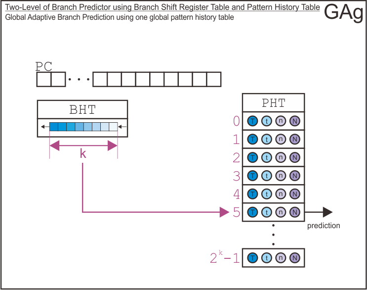 
#### GAs (Global Adaptive Branch Predictor using per-set pattern history table)
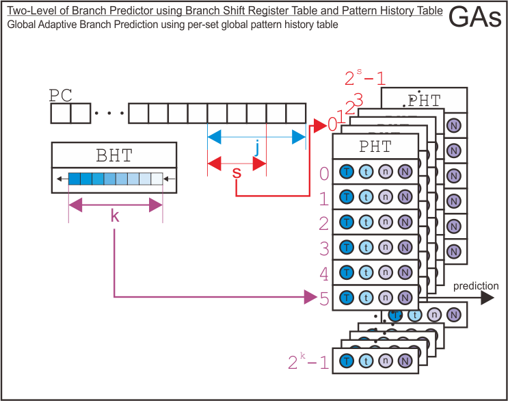 
#### GAp (Global Adaptive Branch Predictor using per-address pattern history table)
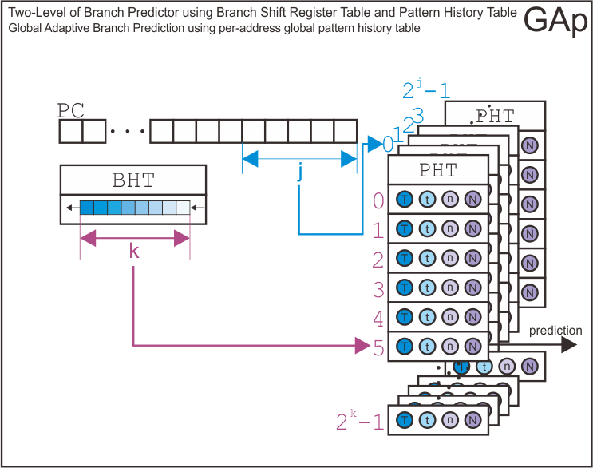 
#### SAg (Per-Set Adaptive Branch Predictor using one global pattern history table)
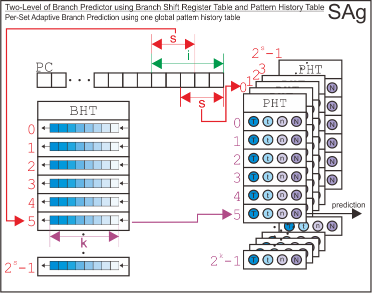 
#### SAs (Per-Set Adaptive Branch Predictor using per-set pattern history table)
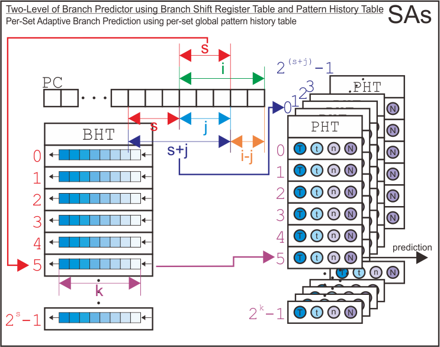 
#### SAp (Per-Set Adaptive Branch Predictor using per-address global pattern history table)
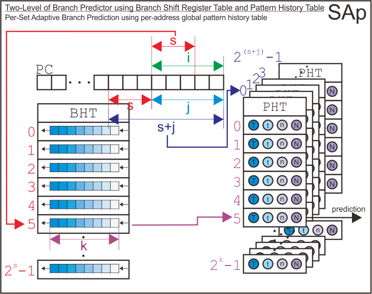 
#### PAg (Per-Address Adaptive Branch Predictor using one global pattern history table)
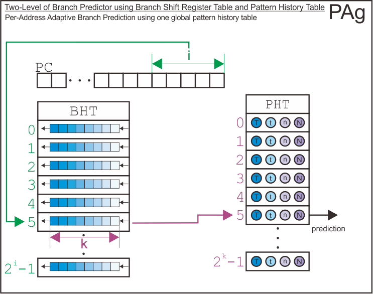 
#### PAs (Per-Address Adaptive Branch Predictor using per-set pattern history table)
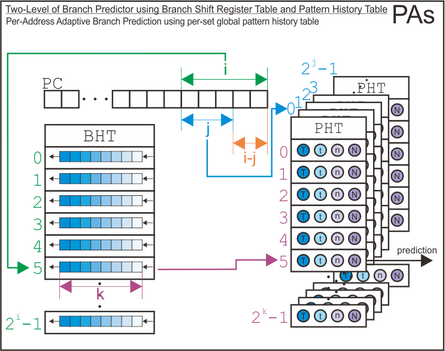 
#### PAp (Per-Address Adaptive Branch Predictor using per-address pattern history table)
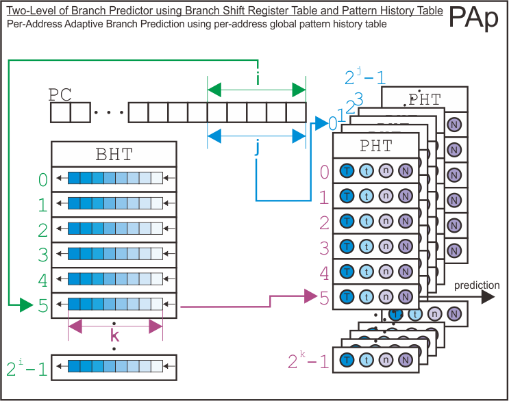 

### Indexing Schemes
Finally, I has derive how the simulator uses address bits to index the entry of branch history shift register table, the pattern history tables, and the entry of pattern history tables based on each configuration.
#### GAg (Global Adaptive Branch Predictor using one global pattern history table)
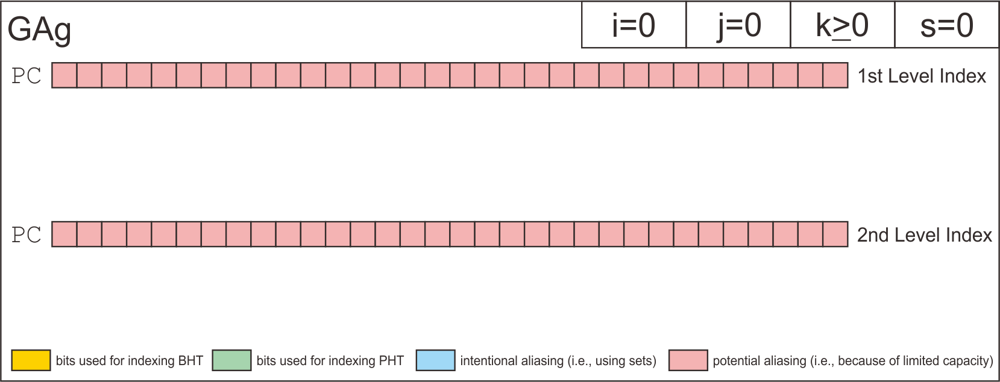 
#### GAs (Global Adaptive Branch Predictor using per-set pattern history table)
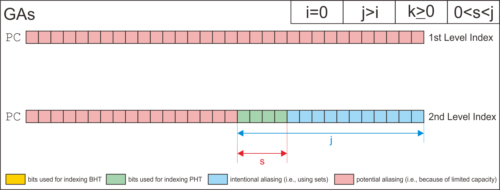 
#### GAp (Global Adaptive Branch Predictor using per-address pattern history table)
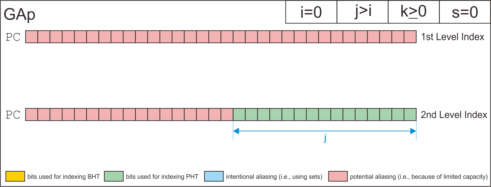 
#### SAg (Per-Set Adaptive Branch Predictor using one global pattern history table)
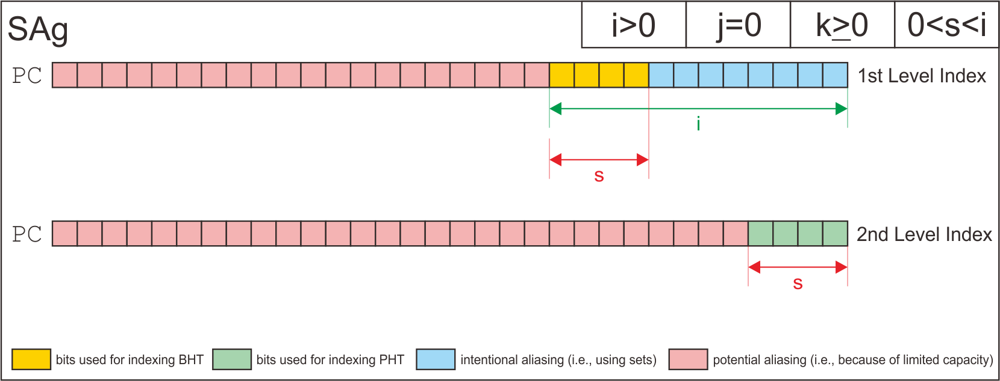 
#### SAs (Per-Set Adaptive Branch Predictor using per-set pattern history table)
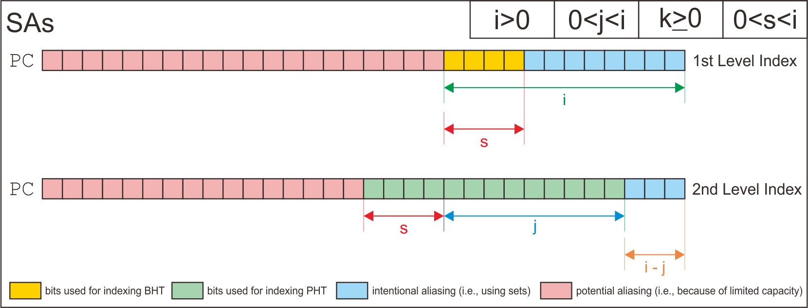 
#### SAp (Per-Set Adaptive Branch Predictor using per-address global pattern history table)
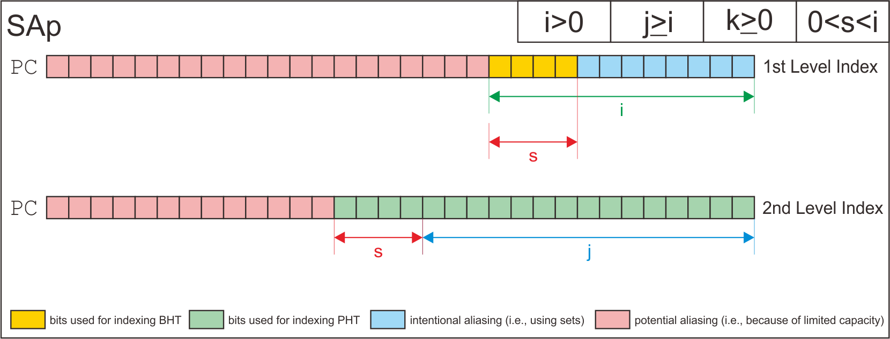 
#### PAg (Per-Address Adaptive Branch Predictor using one global pattern history table)
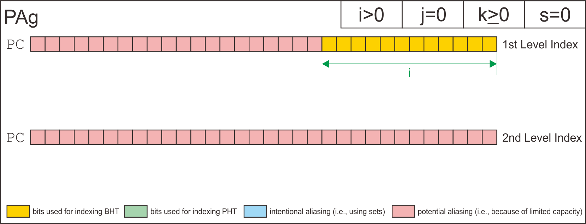 
#### PAs (Per-Address Adaptive Branch Predictor using per-set pattern history table)
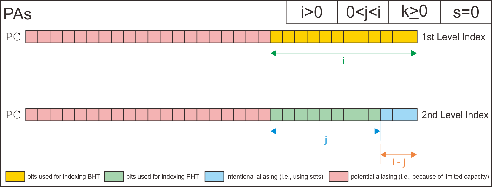 
#### PAp (Per-Address Adaptive Branch Predictor using per-address pattern history table)
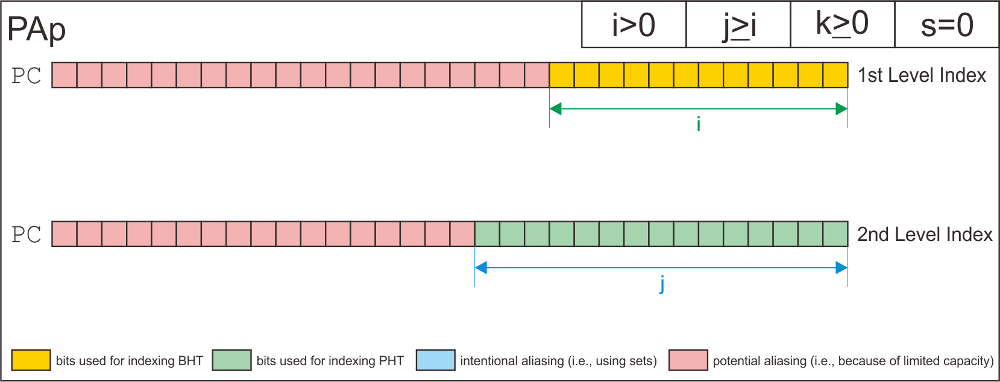 

## Contributing and Citing
If you are interested to use or modify the code for your next project, please cite accordingly. I will be very grateful for any contribution on this code.
```
@misc{bagus_hanindhito_2020_3834733,
    author       = {Bagus Hanindhito},
    title        = {{Two Level Branch Predictor Simulator}},
    month        = May,
    year         = 2020,
    doi          = {10.5281/zenodo.3834733},
    version      = {1.0.0},
    publisher    = {Zenodo},
    url          = {https://doi.org/10.5281/zenodo.3834733}
    }
```

## Authors
Bagus Hanindhito  
Graduate Student at Department of Electrical and Computer Engineering  
The University of Texas at Austin  

## License
The code is licensed under GNU Affero General Public License v3.0. Please see LICENSE file included in the source code.

## Acknowledgments
* Lizy K. John (Lecturer)
* Jiajun Wang (TA)
